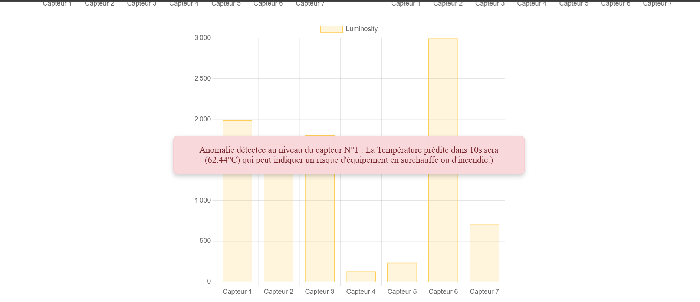
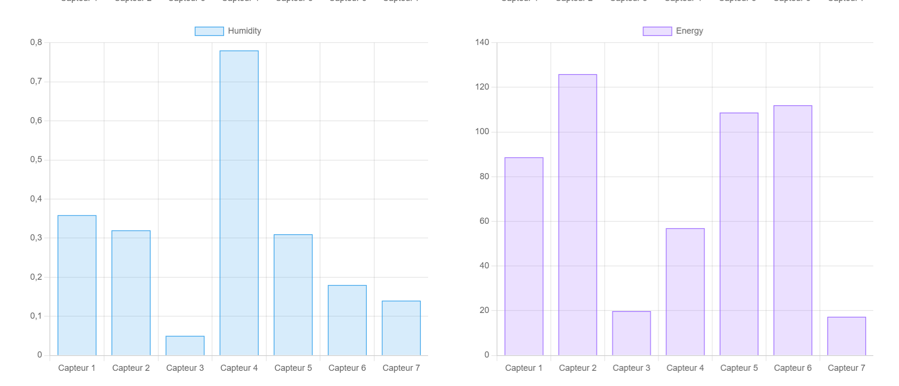
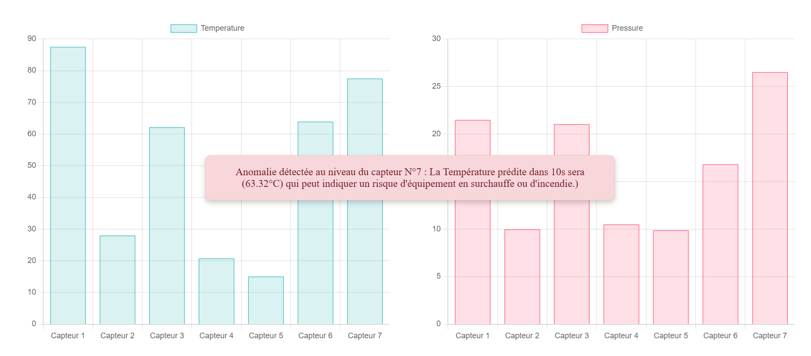
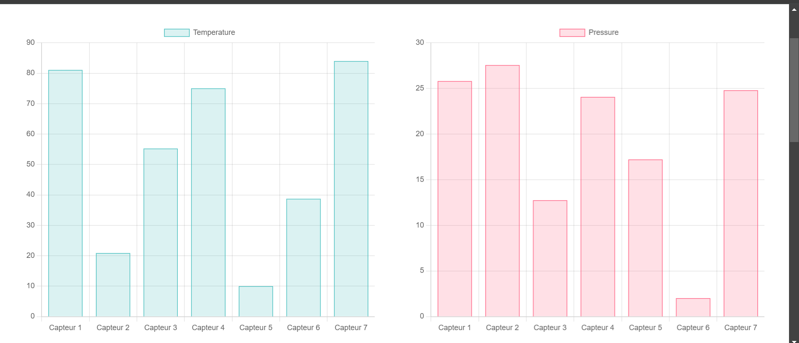
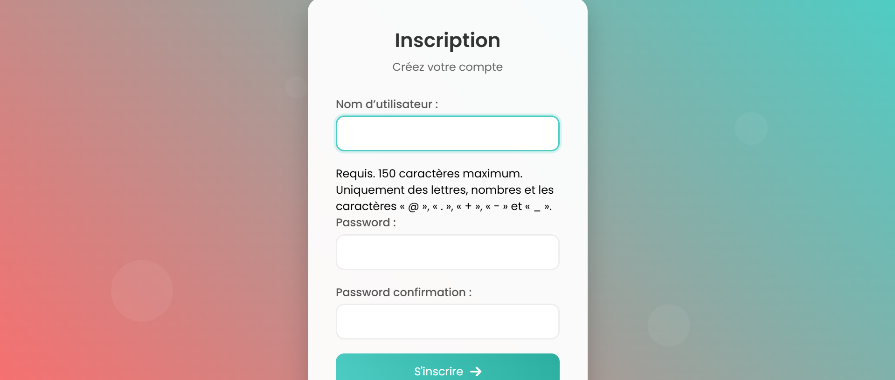
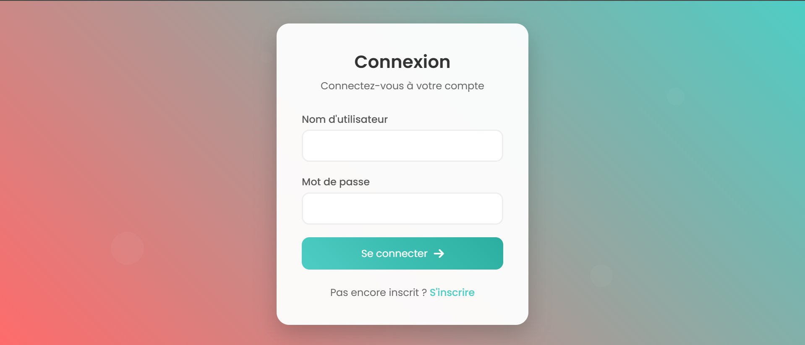

# SmartFactoryHub

Dans le cadre d'un exposé lors du cours sur `Big Data et NoSQL` à `IAI-TOGO` ayant pour thème `Impact de l'IOT et du Big Data dans l'industrie 4.0`
Voici une application django mettant en avant l'IOT et le Big Data à travers la
maintenance prédictive

# Description
Il a été question d'utiliser un broker mqtt pour simuler des données de capteurs , puis de remplir une base de données avec 200 lignes de données pour entrainer des models de prédiction de données pour ensuite afficher les données sous formes de statistiques avec des alertes définies sur certains seuilles de ces données

# Capture

# Installation

- Avec Github : git clone https://github.com/Harlequelrah/Library-harlequelrah_fastapi"

# Contact ou Support

Pour des questions ou du support, contactez-moi à maximeatsoudegbovi@gmail.com ou au (+228) 91 36 10 29.
ou le profil de mon équipe à travers les liens github suivant :
- https://github.com/Isaacmazamesso
- https://github.com/naporafia0112
- https://github.com/lecodesource
- https://github.com/josianesenyo
- https://github.com/jordanBuilder
